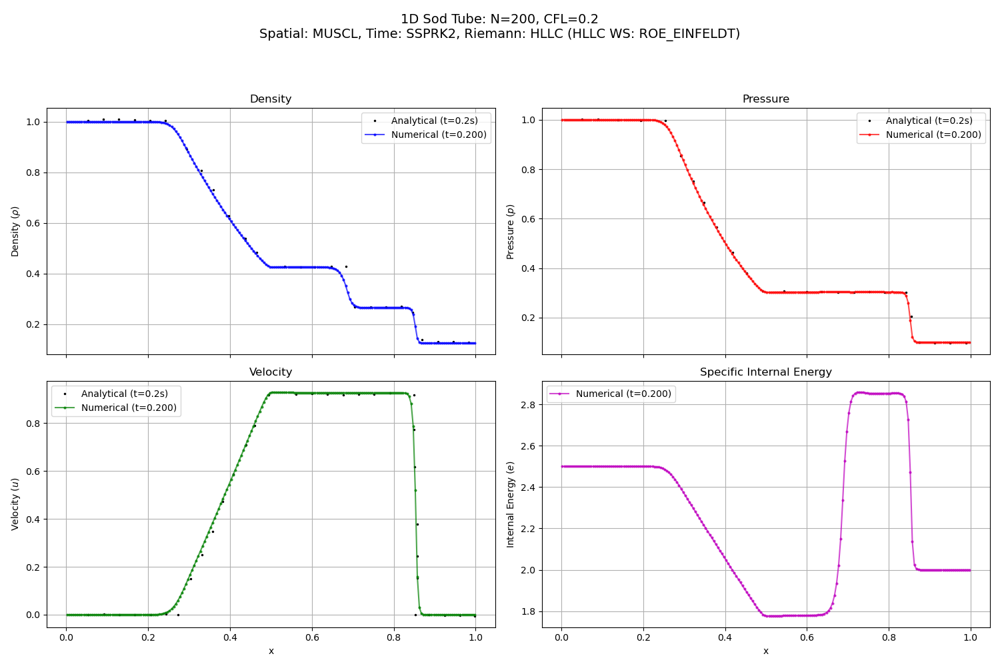

# Python 1D Euler Solver for Sod Shock Tube

## Overview

This is a simple Python project implementing a Finite Volume Method (FVM) solver for the 1D Euler equations. The primary test case is the standard Sod Shock Tube problem.

This code has been developed for learning purposes to explore fundamental concepts in Computational Fluid Dynamics (CFD).

## Core Features

* **Governing Equations:** 1D Euler equations for compressible, inviscid flow.

* **Numerical Method:** Cell-centered Finite Volume Method (FVM).

* **Spatial Discretization Schemes:**
    * **First-Order:** Standard Godunov-type scheme with piecewise constant reconstruction.
    * **Second-Order MUSCL:** A higher-order scheme for sharper results, featuring:
        * Piecewise linear data reconstruction.
        * `minmod` slope limiter to prevent spurious oscillations.

* **Time Integration Schemes:**
    * **Forward Euler:** First-order accurate.
    * **SSPRK2:** A second-order Strong Stability Preserving Runge-Kutta method for improved accuracy and stability with MUSCL.

* **Riemann Solvers:**
    * **HLL:** A robust, approximate Riemann solver.
    * **HLLC:** A more accurate solver that fully resolves contact discontinuities, with selectable wave speed estimation methods:
        * `simple_bounds`: Based on simple eigenvalue estimates.
        * `roe_einfeldt`: Based on more robust Roe Averages.

* **Boundary Conditions:**
    * **Transmissive:** For outflow boundaries, allowing waves to leave the domain.
    * **Reflective:** For simulating solid walls where waves reflect.

* **Equation of State (EOS):**
    * Ideal Gas Law, with a configurable adiabatic index (`gamma`).

* **Workflow and Usability:**
    * Simulation parameters are controlled via an external **JSON configuration file**.
    * Modular Python code structure (e.g., `riemann_solvers.py`, `schemes_spatial.py`, etc.).
    * Automated saving of results to uniquely named directories or a fixed "output" folder.
    * Separate post-processing script for plotting results and creating animations from saved frames.

## Some Results

### Sod's Shock Tube with Transmissive Boundaries

Animation showing the time evolution of density, pressure, velocity, and internal energy up to t=0.2s with transmissive (outflow) boundary conditions. The characteristic rarefaction wave, contact discontinuity, and shock wave can be seen propagating through the domain.

<video src="./doc/transmissive_boundaries.mp4" controls="controls" style="max-width: 730px;"></video>

*(Simulation run with: MUSCL, SSPRK2, HLLC)*

### Comparison with Analytical Solution

The solver's results show good agreement with the analytical solution for Sod's problem at t=0.2s. The higher-order MUSCL scheme captures the shock and contact discontinuities, though some numerical diffusion is still present as expected.

### Shock Reflection with Reflective Boundaries

This animation shows a more complex case where the initial shock wave propagates to the right, hits a solid (reflective) wall, and reflects back into the domain, creating complex wave interactions.

<video src="./doc/reflective_boundaries.mp4" controls="controls" style="max-width: 730px;"></video>

*(Simulation run with: MUSCL, SSPRK2, HLL for stability at the wall)*

## Running the Code

*(More detailed instructions on parameters and plotting can be added later.)*

## Reference Problem

The main validation case is Sod's Shock Tube problem, as described by:
Sod, Gary A. “A Survey of Several Finite Difference Methods for Systems of Nonlinear Hyperbolic Conservation Laws.” *Journal of Computational Physics* 27, no. 1 (April 1, 1978): 1–31.

## Note

This is primarily a learning project and not intended as a production-grade CFD tool.
